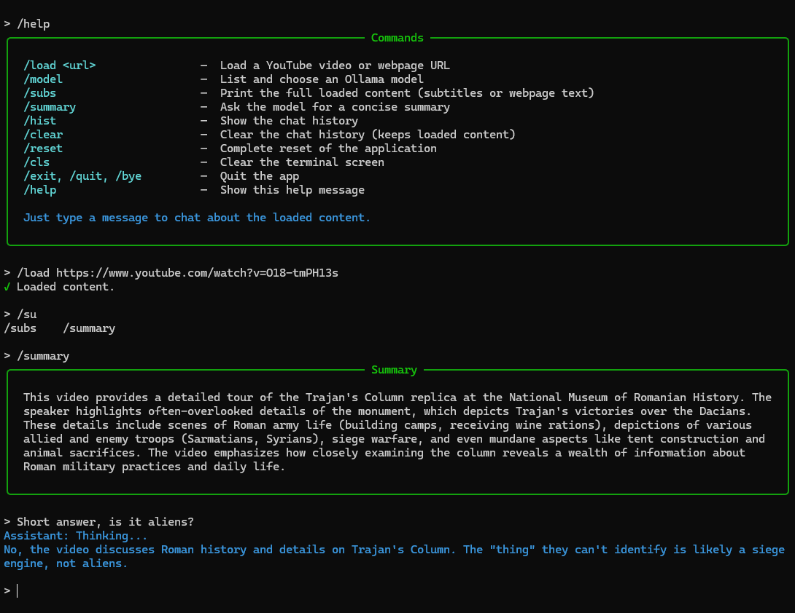

# Youtube & Webpage Chat

A small CLI tool to load YouTube subtitles or webpage text and chat about the content using a local LLM (Ollama) or free OpenRouter models.



*Screenshot of the CLI in action*


**Features**
- Load YouTube transcripts (when available) or scrape webpage text
- Ask questions, get summaries, and interact with the loaded content via LLM
- Multiple LLM providers: local Ollama or free tier OpenRouter models
- Switch between providers mid-session while preserving conversation history
- Select from available models and adjust context size
- Nice CLI: tab-completion for commands and persistent command/history accessible with the arrow keys


**Requirements**
- Python 3.11 – 3.14
- For Ollama: Ollama running locally and reachable from this machine
- For OpenRouter: free API key from https://openrouter.ai/keys
- Network access for fetching YouTube transcripts and webpages


**Install**
1. Install Poetry (optional but recommended):

```bash
pip install poetry
```

2. Install dependencies:

```bash
poetry install
```

3. (Optional) Set up environment:

```bash
cp .env.example .env
```

If you plan to use OpenRouter, add your API key to the `.env` file:
```
OPENROUTER_API_KEY=your_api_key_here
```

You can run the test-suite with Poetry:

```bash
poetry run pytest -q
```

**Run**

```bash
poetry run python src/main.py
```

The app starts a small REPL. On first run, you'll be prompted to select your LLM provider (Ollama or OpenRouter). Type `/help` to see available commands.

CLI tips:
- Use Tab to complete commands (e.g. type `/lo` then press Tab for `/load`).
- Use Up/Down arrow keys to traverse previous commands and messages.

**Common Commands**
- `/load <url>` — Load a YouTube video or webpage URL
- `/provider` — Switch between Ollama and OpenRouter (preserves conversation history)
- `/model` — List and choose a model (lazy-loaded on first use)
- `/subs` — Print the full loaded content (subtitles or webpage text)
- `/summary` — Ask the model for a concise summary of the loaded content
- `/hist` — Show the chat history used as context for the model
- `/ctx <size>` — Set model context size
- `/clear` — Clear the chat history (keeps loaded content)
- `/reset` — Reset the whole application state
- `/cls` — Clear the terminal screen
- `/help` — Show help
- `/exit` — Quit the app

**Configuration**

The app uses a `.env` file for configuration:

```
OPENROUTER_API_KEY=your_key_here          # For OpenRouter provider
SELECTED_LLM_PROVIDER=ollama              # Provider choice (ollama or openrouter)
SELECTED_MODEL=llama2                     # Model selection (persisted)
```

**On first run:**
- If no `.env` file exists, you'll be prompted to select a provider (Ollama or OpenRouter)
- For OpenRouter: ensure `OPENROUTER_API_KEY` is set in `.env`
- Your provider choice is saved to `.env` for future sessions

**Notes & Troubleshooting**

- **Ollama**: Must be running locally. Ensure Ollama is started and reachable before using the provider.
- **OpenRouter**: Requires internet connection and a free API key from https://openrouter.ai/keys
- **Model availability**: Models are lazy-loaded when you run `/model` command, not on startup.
- **YouTube transcripts**: Some videos have transcripts disabled; the tool will report this.
- **Provider switching**: You can switch between providers at any time using `/provider` — your conversation history will be preserved.

**Architecture (high level)**
- `src/services/__init__.py` — `LLMClient` protocol defining the interface for LLM providers
- `src/services/ollama_client.py` — wrapper around the `ollama` module implementing `LLMClient`
- `src/services/openrouter_client.py` — OpenRouter API client implementing `LLMClient`
- `src/services/llm_factory.py` — factory function to create appropriate LLM client based on user selection
- `src/services/content_fetcher.py` — fetches YouTube transcripts and webpage text
- `src/app/controller.py` — core business logic, maintains conversation state and supports provider swapping
- `src/main.py` — thin CLI adapter built on `cmd.Cmd`; supports provider switching via `/provider` command

This separation keeps I/O and third-party integrations separate from the pure application logic, improving testability and maintainability.

**Directory structure**
```
youtube_subs/
├── src/
│   ├── main.py                    # CLI entrypoint
│   ├── app/
│   │   └── controller.py          # core business logic
│   ├── renderers/
│   │   └── rich_renderer.py       # styled terminal output
│   └── services/
│       ├── __init__.py            # LLMClient protocol
│       ├── ollama_client.py       # Ollama provider
│       ├── openrouter_client.py   # OpenRouter provider
│       ├── llm_factory.py         # factory for creating LLM clients
│       └── content_fetcher.py     # fetch YouTube & webpage content
├── tests/                         # unit tests
│   ├── conftest.py
│   └── test_controller.py
├── .env.example                   # example environment configuration
├── Readme.md
└── pyproject.toml
```

**Architecture diagram (boxed)**
```
┌─────────────────┐     ┌─────────────────────────────────────┐
│      User       │ <-> │ CLI: cmd-shell (uses Rich-renderer) │
└─────────────────┘     └─────────────────────────────────────┘
		    					    		│
		    	    						▼
		    				 ┌────────────────────────────┐
		    				 │  ContentController (core)  │
		    				 │  (business logic / state)  │
		    				 └────────────────────────────┘
		    		        	 ↙                    ↘
	        	┌─────────────────────┐         ┌──────────────────────┐
	        	│   ContentFetcher    │         │     LLMClient        │
	        	│   (YouTube / Web)   │         │   (via factory)      │
	        	└─────────────────────┘         └──────────────────────┘
	        	                                     ↙               ↘
	        	                        ┌──────────────────┐  ┌──────────────────┐
	        	                        │  OllamaClient    │  │ OpenRouterClient │
	        	                        └──────────────────┘  └──────────────────┘
```

**Development**
- The project metadata and dependencies are defined in [pyproject.toml](pyproject.toml).
- To run the script directly without Poetry (assuming your environment has dependencies installed):

```bash
python src/main.py
```

